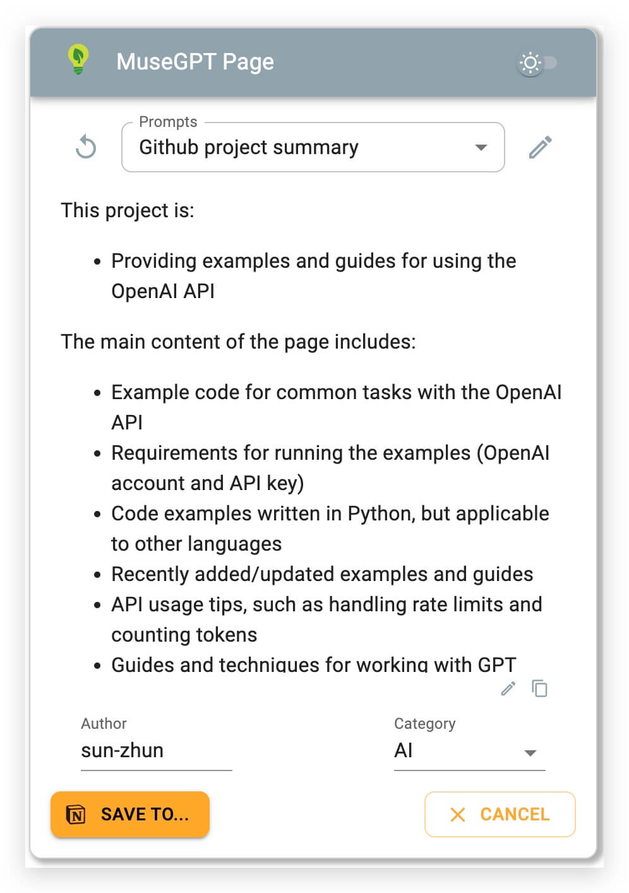
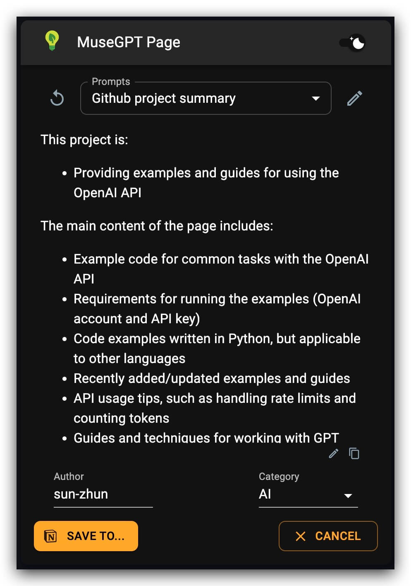
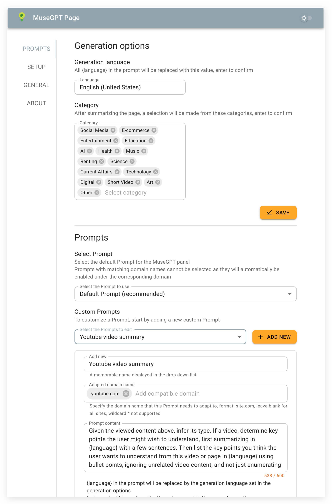
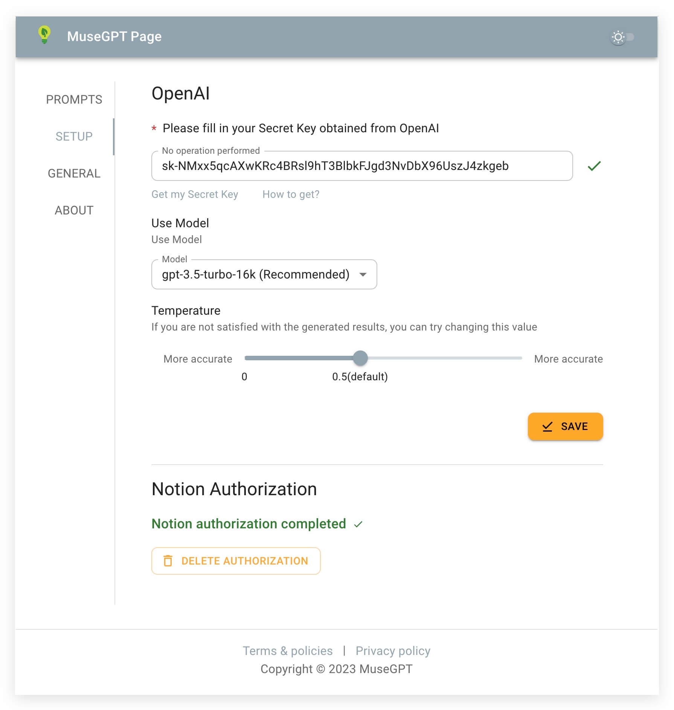

<h1>MuseGPT Page</h1>

    
    
    
    
    
    
    
    
    
    
  

 
This is a Chrome extension that allows you to summarize and categorize the current page with a single click using OpenAI's ChatGPT API. With just one more click, you can save the summary and page information to your Notion table.
The existing features will remain free permanently.

一键用OpenAI ChatGPT对当前打开的页面内容进行提炼和自动分类,并一键整理保存页面信息到Notion表格中.
现有功能永久免费。

<!-- [简体中文](https://github.com/receyuki/stable-diffusion-prompt-reader/blob/master/README.zh-Hans.md) | [English](https://github.com/receyuki/stable-diffusion-prompt-reader/blob/master/README.md) -->
    

## Table of Contents

- [Intro](#intro)
- [Features](#features)
- [Installation](#installation)
  - [Procedures](#procedures)
- [Screenshots](#screenshots)

## Intro 
Introducing a Chrome extension designed to expedite your webpage reading by rapidly distilling key points. It facilitates a convenient and effective way to manage knowledge or captivating content. The extension’s goal is to aid users in seamlessly assimilating information and knowledge from the web page, bypassing the need for manual curation. Feel free to enhance your browsing experience with this tool.

## Features 
* One-click to use ChatGPT for content extraction and automatic classification of the current page
* Support for Command+Shift+X shortcut to call out the panel for extraction (Ctrl+Shift+X for Windows)
* Supports translation and extraction of any page language to your language
* Capable of summarizing video content, including platforms like YouTube, Bilibili, etc.
* Supports extraction and analysis of YouTube and Bilibili video subtitles (Bilibili does not currently support series)
* Display the highlights timestamps of YouTube and Bilibili videos.
* Allows download of successfully extracted YouTube or Bilibili subtitles as srt files (currently supports only default subtitles language)
* Ideal for quick extraction of key content from news sites
* One-click saving of extracted page content and categories to Notion
* Supports Markdown formatted display
* Comes with prompts for YouTube, Bilibili, and GitHub.
* Customizable Prompts
* Ability to set domain-specific Prompts
* Editing of generated page summaries
* Material UI
* The summary panel can be dragged anywhere on the page
* Supports configuring the summary panel to automatically pop up on Youtube and Bilibili video pages
* Supports light and dark themes
* Multilingual support

## 特性 

* 一键用ChatGPT对当前打开的页面内容进行提炼和自动分类
* 支持Command+Shift+X快捷键呼出面板提炼(Windows下为Ctrl+Shift+X)
* 支持将任意页面语言翻译提炼到你的的语言
* 支持总结视频网站内容,包括YouTube、Bilibili等
* 支持YouTube和bilibili视频字幕提取并进行分析(Bilibili暂不支持剧集)
* 显示YouTube和bilibili视频的精彩时间点
* 下载提取成功的YouTube或bilibili字幕为srt文件(暂时只支持默认语言)
* 可用于新闻类网站快速提炼出关键内容
* 一键将当前页面提炼内容和分类保存到Notion
* 支持Markdown格式化显示
* 自带YouTube ,bilibili及github的prompt
* 自定义Prompt
* 可设置适配Prompt域名
* 编辑生成的网页总结
* Material UI
* 摘要面板可在页面上任意拖动
* 支持配置在Youtube和Bilibili视频页自动弹出摘要面板
* 支持浅色、深色皮肤
* 多语言支持

## Installation 

The plugin is currently in the beta testing phase, so if you want to try it out, please download the latest version from the releases, and then install the plugin according to the following steps:

### Procedures 

1. Click the '...' menu at the top right of Chrome, then select Extensions -> Manage Extensions to enter the Chrome extension management page.
2. Enable 'Developer Mode' at the top right of the Chrome extension management interface.
3. Directly drag and drop the downloaded latest release zip file of the plugin into the current interface.
4. Run the plugin in the normal way, and enter the Secret key obtained from OpenAI as guided in the installation wizard.

## Screenshots 

### MuseGPT Page Panel (Lite Theme) 

### MuseGPT Page Panel (Dark Theme) 

### Option Prompts Edit 

### Option Prompts Setup

## 

---
## Thanks To

---
